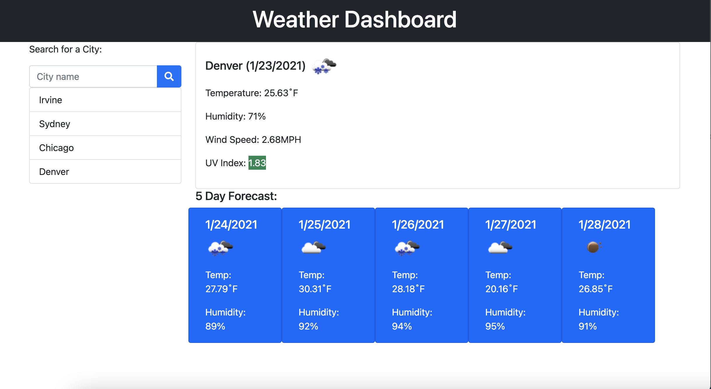

# Homework06-WeatherDashboard
Repository for Homework 06 - Weather Dashboard

## Project Screen Shots

## User Story
AS A traveler  
I WANT to see the weather outlook for multiple cities  
SO THAT I can plan a trip accordingly  

## Weather Dashboard instructions
1. Type city name into the input field.
2. Click search button to display current weather info and 5 day forecast
3. Type in another city name
4. Click search button to display current weather info and 5 day forecast for new city
5. Repeat!

## Application Criteria
1. When the user opens the dashboard, they are presented with a search field
2. When the user searches for a city, if the city exists then they are presented with current and future conditions for that city
3. The current data presented includes:
   1. city name
   2. current date
   3. weather condition icon
   4. temperature in F
   5. humidity
   6. wind speed in MPH
   7. UV index with color indicators for favorable, moderate, or severe
4. The forecast data presents data cards for next 5 days which include:
   1. future date
   2. weather condition icon
   3. temperature in F
   4. humidity
5. The searched city is added to the search history if the city does not already appear on the list
6. When the user clicks on a city in the search history, they are again presented with current and future weather data for the selected city